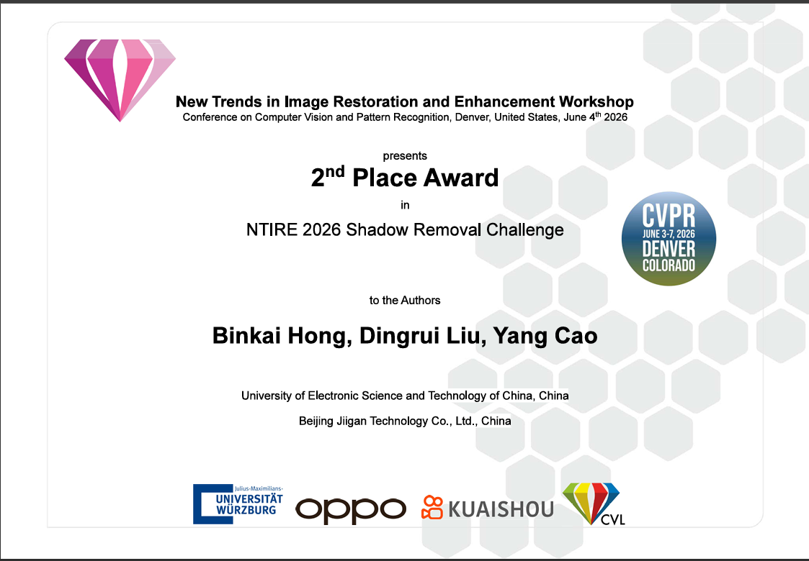

# RASnet: Remove Any Shadow

<div align="center">

[](https://cvlai.net/ntire/2026/)
[](https://openaccess.thecvf.com/content/CVPR2026W/NTIRE/html/Vasluianu_Advances_in_Single-Image_Shadow_Removal_Results_from_the_NTIRE_2026_CVPRW_2026_paper.html)
[](https://cvlai.net/ntire/2026/)

<br>


<br>

## 🏆 **2nd Place** in NTIRE 2026 Single-Image Shadow Removal Challenge @ CVPR 2026



</div>

---
## 📄 Paper

Our challenge report is accepted at **CVPR 2026 Workshop (NTIRE)**:

> [**Advances in Single-Image Shadow Removal: Results from the NTIRE 2026**](https://openaccess.thecvf.com/content/CVPR2026W/NTIRE/html/Vasluianu_Advances_in_Single-Image_Shadow_Removal_Results_from_the_NTIRE_2026_CVPRW_2026_paper.html)
> <br>*Florin-Alexandru Vasluianu, ... (NTIRE 2026 participants)*
> <br>CVPR 2026 Workshop on New Trends in Image Restoration and Enhancement

---
## Method

RASnet borrows the stage 1 and stage 3 training processes from the paper [Dereflection Any Image with Diffusion Priors and Diversified Data](https://arxiv.org/pdf/2503.17347), and extends them to become the algorithm used in the NTIRE 2026 Image Shadow Removal Challenge.

We make the following modifications to the original method:
- 💎 In stage 1, a pixel-space loss function is introduced to alleviate the problem of blurry generated images, while the features of DINOv3 are used to enhance shadow removal capabilities.
- 💎 We skipped stage 2 because we found it had limited impact on the final result in this task.
- 💎 In stage 3, we introduce FFL (Focal Frequency Loss) to help VAE better reconstruct image details.

## Quick Start

### Environment
```bash
pip3 install -r requirements.txt
```
Our experiment was run on CUDA 11.8, and the same configuration is recommended.

### Pre-trained Models
Ensure that the model weights are stored in the same directory as below.

| dirname    | download link                                                                                             | dir within the code |
|------------|-----------------------------------------------------------------------------------------------------------|----------------------|
| sd         | [Google Drive](https://drive.google.com/drive/folders/1w71cca44VKyhMZHX0lqCNDJKkpl1B_ha?usp=drive_link)  | `weights/sd`         |
| controlnet | [Google Drive](https://drive.google.com/drive/folders/1H6xlZ30U5PTrLXlStO9TuNy6SykBPB8O?usp=drive_link)  | `weights/controlnet` |
| cross_vae  | [Google Drive](https://drive.google.com/drive/folders/1Bk2TSmPLWDACSY4If_DTGXbIPo2iS50g?usp=drive_link)  | `weights/cross_vae`  |

### Training
> ⏳ Code will be released soon.

### Inference
```bash
python3 test.py \
    --pretrained_dai weights/sd \
    --controlnet weights/unet/checkpoint.pt \
    --cross_vae weights/cross_vae \
    --input_dir inputs/ntire26_shadow_test_in \
    --output_dir outputs/results/ntire26_shadow_test_out
```

### Results
You can download our results via the following link:
- [Google Drive](https://drive.google.com/file/d/1CGZq0mwFpmISa7Kf1lipWFBQDnAimM_F/view?usp=drive_link)

## Citation
If you find this work useful, please consider citing:
```bibtex
@InProceedings{Vasluianu_2026_CVPRW,
    author    = {Vasluianu, Florin-Alexandru and others},
    title     = {Advances in Single-Image Shadow Removal: Results from the NTIRE 2026},
    booktitle = {Proceedings of the IEEE/CVF Conference on Computer Vision and Pattern Recognition (CVPR) Workshops},
    year      = {2026},
}
```